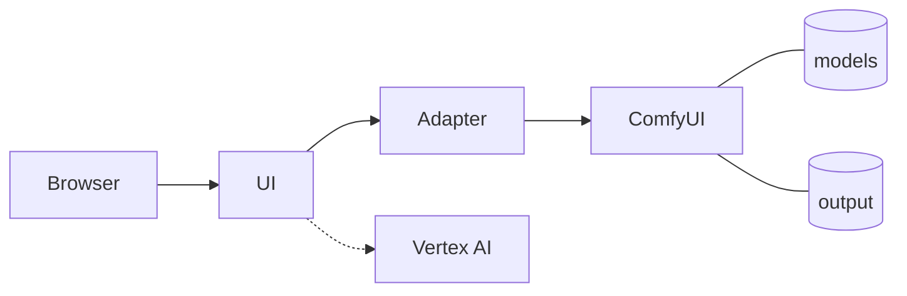
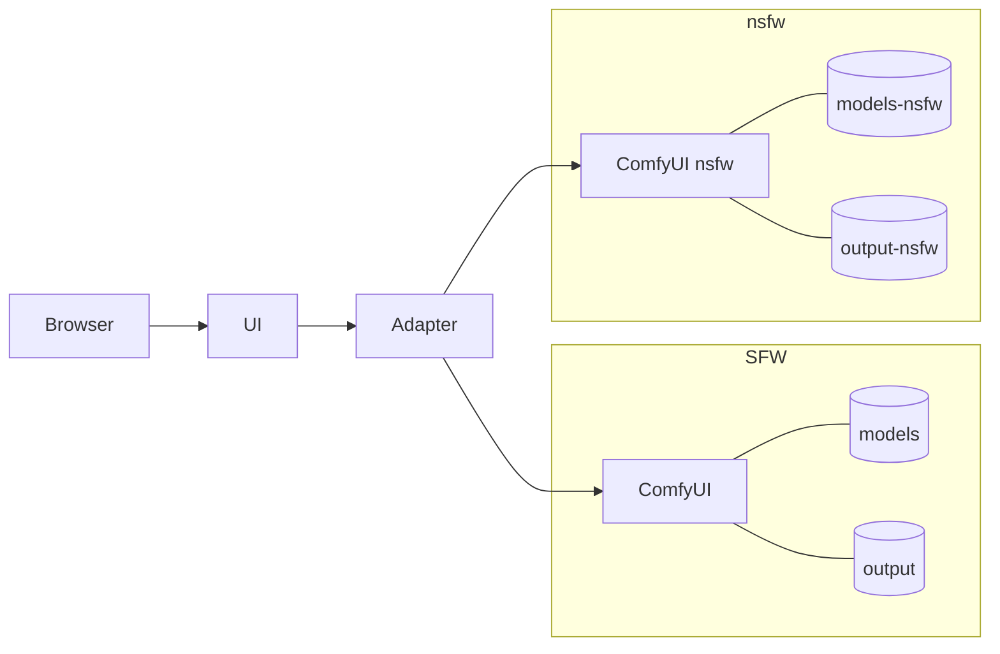
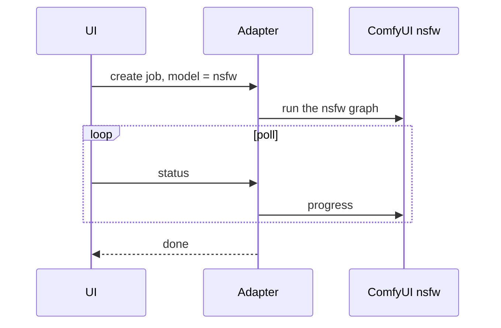

# EPIC_010 — An NSFW model in its own container

**Status:** Proposed (2026-09-19 16:10 EDT — drafted from [SPIKE_001](../spike/SPIKE_001_the_nsfw_model_spike.md), approved 16:04: "Ok this looks good, using the spike create the epic and then proceed with creating all the associated stories in order of implementation"; the four stories below are drafted and linked, each read against the code it constrains)
**Started:** 2026-09-19 17:00 EDT (STORY_063 approved with the spike's night: "Go: build STORY_063 first, then the night")
**Decisions of 16:50 (the owner, by the tool):** the manifest lists all eight matrix files; the label is *MiniMax-H3 (uncensored)*; the tag is *NSFW*; the skill's genre is *uncensored* (shown *Uncensored*). STORY_061 shipped on 2026-09-19 as adapter 1.6.0 / contract v1.5 (the peer session's push 4d8c5ef), so STORY_064 is adapter 1.7.0 / contract v1.6.

## Goal

The Spark serves a second flavour of MiniMax-H3 for adult content — **naked male anatomy first**, the owner's stated priority — in **its own container beside the SFW one**, isolated as far as a container can be (its own image tag, models, output, logs, port, template, start/stop) so that when something goes wrong it is obvious which half it is in, and the SFW flow that runs today is never touched. After this epic the owner picks *MiniMax-H3 (uncensored)* in the composer's model menu, sends, and the job runs on the NSFW container with the variant [SPIKE_001](../spike/SPIKE_001_the_nsfw_model_spike.md)'s matrix chose; history, Recents, Assets and the task page mark the entry; a Settings switch hides such entries; the prompt is written with a director skill of our own, run by the assistant, never by the cloud director.

**Constraints inherited from the licence** (SPIKE_001 › Findings 1 — the MiniMax H3 Community License, read 2026-09-19; not legal advice, the owner's decisions): (a) nothing that exploits or harms minors, absolute (Exhibit A §6 and the law); (b) reference photos only of adults who have consented to be depicted this way (§13); (c) outputs posted publicly carry a disclosure (§12); (d) **the NSFW model is reachable by the owner alone** — no bot, no shared login, no third-party surface — until a story adds the §V.5 safeguards. Every story in this epic keeps (d) by construction: the container listens on 127.0.0.1 and the compose network only, like the SFW one, and the UI stays LAN-only as today.

## What exists today (read from the code and the box, 2026-09-19 12:00–16:00 EDT — SPIKE_001 › Current state and Architecture)

- One UI (`minimax-app` :3000), one adapter (`minimax-adapter` :4020, **one upstream** `COMFY_URL`, **one template** `h3_t2v_prompt.json`), one ComfyUI (`minimax-comfyui` :8188, image `minimax-spark/comfyui:v0.35.1`), one models directory (`spark/data/models/`, the base files 84.5 GB, `loras/` empty), one output directory. ComfyUI's own queue is the one-GPU rule.
- The job API already carries a **`model`** field and `capabilities.models` (contract v1.5, one entry); the composer already renders a **model menu** from `caps.models` (`Composer.tsx:574–590`) and sends `state.model`; `HistoryParams.model` is stored per entry; an extension's chip is disabled while extending and the contract requires an extension's `model` to equal its source's. **So the switch the owner asked for is the model menu's second entry**, not a new control.
- The adapter answers 503 with `NOT_RUNNING` while ComfyUI is down (`server.ts:311`), and the app's queue holds a job on 503 (`queue-runner.ts:161`) with a line the Scheduled page shows (`queue-view.ts:96–97`).
- The director skills are folders under `agents/skills/` listed by `GET /api/agent/skills`, shown on the Skills page with a meta line from their `metadata` (`lib/agent-skills.ts`), chosen in the Agent chip's menu, and run on Vertex by `lib/agent-service.ts` (a refusal comes back verbatim).
- The stub generation server (`tools/stub-generation-server/`) offers one model, records each job's request, and has `/__stub/busy` and `/__stub/reset` hooks; every lane of the gate runs against it.
- SPIKE_001's desk half is done (the licence, the catalogue, the male-anatomy adapters, the architecture); **its Spark half — the matrix that picks the variant — still waits for the owner's go and his photo.** Its answer fills STORY_064's template and STORY_063's manifest; the stories are written so that 063 can land before the night and serve it.

## Decisions carried from SPIKE_001 (the owner's, 2026-09-19; the epic does not reopen them)

Its own container for the NSFW model, the SFW one untouched; **one container up at a time** (a switch is `stop.sh` one and `run.sh` the other, about a minute); **the base weights copied into `models-nsfw/`** — nothing mounted from the SFW side; **one adapter with two upstreams** (the one-GPU rule stays in ComfyUI's queue; a GPU slot for "both up" is a later story, if ever); **history is one list with a badge and a hide filter**; **the prompts come from our own director skill, run by the assistant**, never Vertex; **no male-anatomy LoRA of our own until the spike's matrix says the community's fall short**; the matrix's subject is a photo of a consenting adult the owner names; the motion prompt is a solo act.

## Architecture

### Today

| Box | Container · port | What it is | Reads / writes |
| --- | --- | --- | --- |
| UI | `minimax-app` · 3000 | the video generation screen (`compose.yaml`, project `minimax`) | `history.json`, `queue.json`, `projects.json`; `MODEL_BASE_URL = http://adapter:4020` |
| Adapter | `minimax-adapter` · 4020 | the job API (`spark/comfyui/compose.yaml`, project `minimax-spark`): `POST /jobs`, `GET /jobs/:id`, `/result`, `/poster`, `/capabilities`, `/health` | one upstream `COMFY_URL = http://comfyui:8188`; one template `h3_t2v_prompt.json`; `jobs.json`; the results from `output/` (read-only) |
| ComfyUI | `minimax-comfyui` · 127.0.0.1:8188 | ComfyUI v0.35.1 on the GPU; its own queue serialises the jobs | 13.7 GiB resident idle; 64 GiB drawing a 5 s clip, up to 97 GiB on the worst extension |
| models | `spark/data/models/` | fl2va int8 34.0 GB, ref2va int8 34.0 GB, text encoder 15.7 GB, two VAEs 5.8 GB; `loras/` empty | bind mount |
| output | `spark/data/output/` | the videos and posters; `adapter/`, `logs/`, `smoke/`, `input/` beside it | bind mount |
| Vertex AI | — | Gemini, the director (EPIC_009), agent mode only | — |

### After this epic

| Piece | SFW | NSFW | Why it is separate |
| --- | --- | --- | --- |
| Container · port | `minimax-comfyui` · 127.0.0.1:8188 | `minimax-comfyui-nsfw` · 127.0.0.1:8189 (in-container 8188) | its log is only its log; it can be stopped, rebuilt or removed with the SFW one untouched |
| Compose service · profile | `comfyui`, default | `comfyui-nsfw`, profile `nsfw` | `compose up` never starts it by accident; `run.sh --nsfw` is the only way |
| Image | `minimax-spark/comfyui:${COMFYUI_TAG}` (v0.35.1, pinned, unchanged) | `minimax-spark/comfyui:${COMFYUI_TAG_NSFW}` — today the same tag | a node pack, a patch or a ComfyUI bump a variant needs lands on the NSFW side first, never in the image the gate and the SFW flow depend on |
| Models | `spark/data/models/` (read-write, as today) | `spark/data/models-nsfw/` as the container's **whole** models directory: its own copy of the base files it loads plus the variant files, every one on `spark/comfyui/nsfw-files.tsv` with its SHA-256 (STORY_063) | **nothing is mounted from the SFW side** (the owner, 2026-09-19 14:10: "isolation is worth it"); the NSFW container can be moved, rebuilt or deleted with its models and never opens an SFW path |
| Output · logs | `spark/data/output/` | `spark/data/output-nsfw/` (mounted read-only into the adapter as `/comfy/output-nsfw`) | adult videos and posters never sit in the SFW directory; a bad file is findable by directory |
| Graph template | `h3_t2v_prompt.json` (unchanged) | `h3_nsfw_prompt.json`: the checkpoint, the LoRA chain with strengths, the sampler settings — filled from the spike's answer (STORY_064) | a bad strength or a sampler change is one file, diffable |
| Job API | one adapter; `model: minimax-h3` (the default) | the same adapter; `model: minimax-h3-nsfw` (STORY_064) | one job store, one history, one queue; the adapter probes both upstreams, lists each with `ready` and a reason, and refuses (or the app's queue holds) a job for the server that is not up; its log names the upstream on every line |
| Start · stop · verify | `run.sh` / `stop.sh` / `verify.sh` | `run.sh --nsfw` / `stop.sh --nsfw` / `verify.sh --nsfw` (STORY_063) | one at a time: `run.sh --nsfw` stops the SFW container first and refuses while a job runs or waits on it; the reverse for `run.sh` |
| Fetch | `fetch-h3.sh` (Comfy-Org's files by name and size) | `fetch-nsfw.sh` (the manifest: base files copied locally, variant files downloaded, every file hashed; `CIVITAI_TOKEN` from the environment or the repo's `.env`, never printed) | the NSFW files are a list in the repo, not a memory |
| The prompt | the director skills on Vertex (EPIC_009) | `agents/skills/minimax-h3-director-uncensored/`, run by the assistant on the owner's photo; marked *manual*; refused by the cloud route (STORY_066) | nothing adult goes to Google |
| The UI | the model menu's first entry, no tag | the menu's second entry *MiniMax-H3 (uncensored)*, an *NSFW* tag on the pill and on every entry drawn with it, Settings › General › *Hide adult results* (STORY_065) | one deliberate choice per task, off by default, visible everywhere, hideable in one place |

### A job in NSFW mode

The SFW container is stopped the whole time. A job for the container that is down is refused with a clear message, or held by the app's queue exactly as an SFW job is held today while ComfyUI is down (`queue-runner.ts:161`), and goes the moment the adapter reports that model ready.

### Why one adapter, not two

The GPU is one, and the rule "one generation at a time" must live in exactly one place. With one container up at a time that place stays where it is today, ComfyUI's own queue, and the adapter's only new duty is to know which upstream is up and to say so. Two adapters would mean two job stores, two histories and a UI that talks to two servers, for no isolation gain below the adapter: the adapter is our own TypeScript, tested against the stub, and its log names the upstream on every line. If both containers are ever allowed up at once, the rule moves into the adapter as a single GPU slot; two adapters could never share one.

## The data on the box

| What | Where | Size | Origin |
| --- | --- | --- | --- |
| The NSFW container's base files (copied) | `spark/data/models-nsfw/{diffusion_models,text_encoders,vae}/` | fl2va int8 34.0 GB · text encoder 15.7 GB · video VAE 5.2 GB · audio VAE 0.6 GB = **55.5 GB** | `copy:` rows of the manifest, from `models/` in minutes on the NVMe |
| Ref2VA (not copied) | a commented row of the manifest | 34.0 GB | only if a Ref2VA variant is ever wanted (Later) |
| The variant files the spike draws | `spark/data/models-nsfw/loras/` and `diffusion_models/` | Mystic XXX v4 155 MB · HMPenis v2 78 MB · Penis Lora v1.1 298 MB · Male Anatomy v2.02 84 MB · NaughtyTimes v3 1.23 GB · HMNSFW AIO V2.5 86 MB · Eros Max beta5 int8 × 2 at 20.97 GB = **43.9 GB** | the manifest's URL rows; Civitai (a token needed for HMPenis and Eros Max; the rest and the Hugging Face files download without one — checked 2026-09-19 16:45) |
| The results | `spark/data/output-nsfw/` | as drawn | the NSFW container; read by the adapter |
| The reference photo | `spark/data/input/nsfw-reference.jpg` | — | the owner's, a consenting adult; never committed |
| Disk after the night | — | ≈ 100 GB of 993 GB free (`df`, 2026-09-19 12:15) | — |

Ports and variables the scripts and the compose files know: `COMFY_PORT` 8188 / `COMFY_PORT_NSFW` 8189 (host); `COMFY_URL` / `COMFY_URL_NSFW` (host side `http://127.0.0.1:<port>`, adapter side `http://comfyui:8188` / `http://comfyui-nsfw:8188`); `COMFYUI_TAG` / `COMFYUI_TAG_NSFW`; `COMFY_EXTRA_ARGS` / `COMFY_EXTRA_ARGS_NSFW`; `GRAPH_TEMPLATE` / `GRAPH_TEMPLATE_NSFW`; `OUTPUT_DIR` / `OUTPUT_DIR_NSFW`; `MIN_FREE_GB`; `CIVITAI_TOKEN`, `HF_TOKEN` (presence reported, values never). `NSFW=1` in the environment points any host script at the NSFW container (`lib.sh › use_nsfw`), which is how `smoke.sh` and `memwatch.sh` serve both.

## The switch, step by step

1. `spark/comfyui/run.sh --nsfw`: refuses if the SFW container has a job running or waiting (its `/queue`), else interrupts nothing, stops it (`compose stop comfyui`), starts `comfyui-nsfw` and the adapter, waits for `/system_stats` on 8189 and for the KJNodes pack, then for the adapter's `/health`.
2. The adapter (STORY_064) sees the SFW upstream go unreachable and the nsfw one reachable; `capabilities.models` flips: the SFW entry `ready: false` with today's reason, the nsfw entry `ready: true`.
3. The UI (STORY_065) greys the SFW entry in the model menu and offers the uncensored one; an SFW job already in the app's queue waits with the Scheduled page's line.
4. `spark/comfyui/run.sh` (no flag) does the reverse. Either direction costs about a minute of container start; the model loads (text encoder ≈ 7 s, DiT 51 s) happen on the first job either way, as they do today.

## Memory and disk

| Case | Resident | Note |
| --- | --- | --- |
| One container idle | 13.7 GiB | measured 2026-09-19 13:13 |
| A 5 s clip | 64 GiB | README's table |
| A 10 s image-to-video | 71 GiB | README's table |
| A +10 s extension of a 10 s source | 89 GiB | README's table |
| The worst measured extension (a 20.75 s source) | 97 GiB | README's table |
| Both containers up, one drawing the worst case | ≈ 111 of 121 GiB | on paper only — why the epic runs one at a time; the spike's row 11 measures the NSFW container's own idle footprint for a later "both up" story |

Disk: the copy and the downloads together ≈ 100 GB of the 993 GB free; no gate trips (`MIN_FREE_GB` 100 on the models-nsfw volume).

## Definition of Done (the epic)

- The four stories are Done with their gates green and their manual verifications recorded (a real draw on the NSFW container from the UI, tagged in history, hidden by the switch; a real switch each way with the refusals exercised).
- SPIKE_001's night has answered and `h3_nsfw_prompt.json` carries its answer with a header comment naming the rows.
- The SFW path is byte-for-byte what it was: `h3_t2v_prompt.json`, the `comfyui` service, `run.sh`'s default path and every existing test unchanged (the diff is additions only, and the e2e suite's existing specs are the proof).
- README › Running the Model has an NSFW subsection (the container, the scripts, the manifest, the switch, the model menu, the tag, the hide switch, the skill) and the adapter table lists the second model; the contract is at v1.6 or whichever number landed.
- The licence constraints (a)–(d) are true on the box: the NSFW container listens on 127.0.0.1 and the compose network only; no third-party surface exists.

## Risks and what catches them

| Risk | Where it would show | What catches it |
| --- | --- | --- |
| A LoRA trained on bf16 misbehaves on the int8 ConvRot checkpoint | the spike's draws | the matrix judges every adapter on our file; an adapter that melts is struck from the manifest |
| Eros Max (hybrid, pruned) does not take FL2VA's first frame or the masked continuation | the spike's rows 7–9 | the rows are drawn, not assumed; the answer may be "LoRAs only" |
| A switch mid-job | `run.sh` | the refusal on a non-empty `/queue`; the manual verification exercises both directions |
| The two model directories drift | a draw that looks different for no reason | every file is on the manifest with its hash; `fetch-nsfw.sh` re-checks present files; `verify.sh --nsfw` checks the loaders list every manifest file |
| The adapter's single-upstream assumptions | STORY_064 | its unit suite drives two fake upstreams; the integration lane drives the stub's second model |
| An adult prompt reaching Vertex | STORY_066 | the manual skill is refused before assembly and the fake Vertex records nothing — a test, not a promise |
| A third party generating on the box | licence §V.5 | none exists today; constraint (d) is written into every story and the container's bind is 127.0.0.1 |

## Time

| | |
| --- | --- |
| **Estimate to completion** (the four stories below, once approved) | ≈ 10 h of build and gates — 063 ≈ 2 h 30 min (a compose service and four script changes, a manifest, shellcheck; plus ≈ 1 h of the Spark copying and fetching), 064 ≈ 3 h (the adapter's second upstream and per-job upstream, the nsfw template, the contract bump, the stub's second model, a container rebuild), 065 ≈ 3 h (the model menu's entry and tag, the badge on four surfaces, the Settings switch, the not-running state, both widths and themes), 066 ≈ 1 h 30 min (the skill folder validated, its meta key, the run route's refusal, the listings) — **plus SPIKE_001's night on the Spark** (≈ 10 h of GPU, the owner's budget), which sits between 063 and 064 |
| **Basis** | EPIC_009's measured pace (its Time table, 2026-09-16/17): a Medium story ≈ 2 h 15 min from approval to Done including two hand gates, a Large ≈ 3 h, every gate ≈ 8–9 min; UI stories at both widths and both themes counted at the upper end |
| **Estimated completion** | From the owner's go, one ticket at a time, the Spark free: 063 landed the same afternoon (≈ 3 h 30 min with the copy), the spike's night that night, its Done note the next morning (≈ 1 h), 064 landed by early afternoon, 065 by the evening, 066 the same evening or the morning after — **about two days from go** |
| **Actual completion** | — |

## Stories (in implementation order)

| # | Ticket | Status | Estimate | Started | Estimated done | Actual done |
| --- | --- | --- | --- | --- | --- | --- |
| 063 | [**The NSFW container**](../story/STORY_063_the_nsfw_container.md) — the compose profile `nsfw`: service `comfyui-nsfw` from the same Dockerfile with its own tag, port 127.0.0.1:8189, `spark/data/models-nsfw/` as its whole models directory and `spark/data/output-nsfw/`; `run.sh --nsfw` (stops the SFW container first, never mid-job), `stop.sh --nsfw`, `verify.sh --nsfw`; `fetch-nsfw.sh` copies the base files locally from `models/` and fetches the variant files by a committed manifest with SHA-256s | Done but for the token rows | ≈ 2 h 30 min (+ ≈ 1 h on the Spark) | 2026-09-19 17:00 EDT | ≈ 20:30 EDT 09-19 | **17:36 EDT 09-19 built and on the box (24 min of build after approval; the fetch 4 min); verified through the night; the switch both ways by 05:50 EDT 09-20** |
| — | [**SPIKE_001's night**](../spike/SPIKE_001_the_nsfw_model_spike.md) — the matrix on 063's container, once the owner says go and names the photo; its answer names the LoRAs (or the checkpoint) and their strengths | Night 1 done (05:48 EDT 09-20); night 2 — the sample-size pass (solo on two more seeds, buttocks on three) — drawing since 14:52 EDT 09-20 until its 07:30 gate; **the judgement: the owner rates every clip on [the rating page](https://claude.ai/artifact/UHvx72tfFnGDCYXr7xAnji)** (an Artifact, private to him: six frames, the run's numbers and a link to each clip, the questions per prompt, a 1–5 score, free text per clip and for the set; the answers save to the page's store and the assistant reads them from there; the clips play from a read-only review server on the Spark's LAN address, port 8790, taken down after the review) | ≈ 10 h GPU | 17:37 EDT 09-19 | ≈ 06:30 EDT 09-20 | **05:48 EDT 09-20 — 26 draws, the 30 s chain held; the last 12 rows drawn 09:08–12:17 once Eros Max was found on Hugging Face (38 of 38); only HMPenis v2 stays unmeasured** |
| 064 | [**The adapter's second upstream**](../story/STORY_064_the_adapters_second_upstream.md) — `COMFY_URL_NSFW`, `GRAPH_TEMPLATE_NSFW`, `OUTPUT_DIR_NSFW`; the adapter probes both servers, `capabilities.models` lists *MiniMax-H3 (uncensored)* with `ready` and a reason (contract v1.6); a job's `model` picks the upstream and the template `h3_nsfw_prompt.json` (the LoRA chain from the spike's answer); a job for the server that is down gets today's 503 so the app's queue holds it; the stub offers the second model and a hook to mark it down | Proposed | ≈ 3 h | — | — | — |
| 065 | [**The uncensored model in the composer**](../story/STORY_065_the_uncensored_model_in_the_composer.md) — the model menu's second entry with an *NSFW* tag on the pill, greyed with the reason while its server is down; the tag on the Recents row, the Assets tile, the task page and the inbox row; Settings › General › *Hide adult results*; Scheduled's line for a held NSFW job; an extension keeps its source's model (already so) | Proposed | ≈ 3 h | — | — | — |
| 066 | [**The NSFW director skill**](../story/STORY_066_the_nsfw_director_skill.md) — `agents/skills/minimax-h3-director-uncensored/` (the owner's word, 16:50): the thirst-trap skill's rules with the Task paragraph for this genre and `metadata` that says it is run by the assistant, not the cloud; the Skills page lists it with *manual* in its meta line; the Agent chip's menu shows it greyed with *manual*; the run route refuses it with a clear message | Proposed | ≈ 1 h 30 min | — | — | — |

The order is the dependency order: 063 first because the spike's night needs the container and the files, and because nothing above it can be verified on the box without it; 064 after the night because its template carries the spike's answer (its code can be written before, its template filled after); 065 after 064 so the UI is built on a route the integration lane already proves against the stub's second model; 066 last because the prompt can be written by the assistant from the skill's draft the whole time, and the product's listing of it is the smallest piece.

## Later, not in this epic's four stories

- **A male-anatomy LoRA of our own** (SPIKE_001 › Findings 4b) — a backlog item only if the spike's matrix says the community's adapters fall short (the owner, 2026-09-19: "wait for the spike's answer").
- **Both containers up at once** with a GPU slot in the adapter — a story if switching ever annoys; the spike measures the second container's footprint (its row 11) so the story starts from a number.
- **Ref2VA in the NSFW container** — 34 GB copied when a reference-mode variant is wanted (the Ref2VA LoRAs: Better NSFW motion, AfterMidnight); the manifest has the row, commented out.
- **The §V.5 safeguards** — only if a third party is ever to generate on this box (a bot, a shared login); until then constraint (d) above holds.
- **Turbo on the stock model** — the community's 4–12-step LoRAs (SPIKE_001 › Technical Notes); a backlog item if the owner wants the speed.
- **A separate adult history** — rejected (the owner, 2026-09-19: one list, badge and hide filter).

## Rules that apply

- **Isolation is the design.** Nothing under `spark/data/models/` is written by the NSFW container, ever; nothing in the SFW image, template, scripts' default paths or gate changes for the NSFW half (a diff of `h3_t2v_prompt.json`, the SFW compose service or `run.sh`'s default path in an epic story is a review comment). The adapter is the one shared piece and its log names the upstream on every line.
- **One at a time.** `run.sh --nsfw` refuses while a job is running on the SFW container and stops it otherwise; the reverse for `run.sh`. Never mid-job (CLAUDE.md § 4a).
- **The gate never touches the model.** Every lane targets the stub with its second model; a draw on the NSFW container is a manual verification in the story's Done note with the date, the files' SHA-256s, the seed and the job id (CLAUDE.md § 3.5, § 4a).
- **The files are checked, never trusted.** Every file in `models-nsfw/` is on the manifest with its SHA-256 (Civitai and Hugging Face both publish them), compared after copy or download; a Civitai token, if one is needed, lives in the Spark's `.env`, never in the repo or the transcript (CLAUDE.md § 4b).
- **Generated videos are gitignored** on both output directories; `spark/data/models-nsfw/` and `spark/data/output-nsfw/` join `.gitignore` in the commit that creates them, and `git status --short` is read before every commit.
- **The owner's photos and prompts are his.** The spike's and the stories' manual verifications use the photo he names; no prompt or frame from them is committed.
