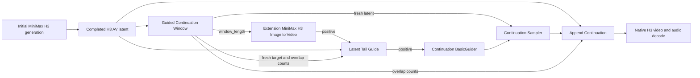

# ComfyUI MiniMax H3 Continuation

Native latent-tail continuation for ComfyUI's MiniMax H3 joint video/audio latents. The working
approach samples a fresh, bounded continuation window while using the synchronized tail of the
previous generation as a native H3 guide. After sampling, the hidden overlap is discarded and only
the newly generated suffix is appended to the original latent.

This approach requires ComfyUI commit `e01fb4c` or newer, which added arbitrary-frame MiniMax H3 AV
guides. The package does not patch, vendor, or monkey-patch ComfyUI, the MiniMax model, or the
samplers.

## Nodes

The package's working workflow uses these three custom nodes:

- **MiniMax H3 Guided Continuation Window** creates a fresh, unmasked target containing a hidden
  overlap followed by the requested visible extension.
- **MiniMax H3 Latent Tail Guide** copies the synchronized video and audio tail of the completed
  latent into the continuation conditioning as a native H3 guide at frame zero.
- **MiniMax H3 Append Continuation** preserves the completed latent, discards the sampled hidden
  overlap, and appends only the newly generated video and audio tokens.

## Installation

Clone or copy this repository beneath ComfyUI's custom-node directory, then restart ComfyUI:

```text
ComfyUI/custom_nodes/comfyui-minimax-h3-continuation
```

No additional runtime dependencies are required. ComfyUI supplies PyTorch and its Python APIs.

The published package is also available from the Comfy Registry as
`comfyui-minimax-h3-continuation`.

## Example workflow

Load [`example_workflows/guided_continuation.json`](example_workflows/guided_continuation.json) in
ComfyUI. It contains the complete, known-working two-pass workflow:



The example first generates a 243-frame clip. It then uses:

```text
overlap_frames   = 22
extension_frames = 119
window_length    = 141
```

The 22-frame overlap is motion context only. The continuation sampler generates the entire
141-frame fresh target, then Append Continuation removes the hidden overlap and contributes 119 new
frames—about five seconds at 24 fps—to the original clip.

## Required connections

1. Connect the completed initial AV latent to **Guided Continuation Window**.
2. Connect its `window_length` output to the extension **MiniMax H3 Image to Video** node's `length`
   input. Leave that node's `first_frame` and `last_frame` inputs disconnected, and do not use its
   empty latent output.
3. Route the extension node's positive conditioning through **Latent Tail Guide**, then connect the
   guide's positive output to the continuation **BasicGuider**. The guide must be on this active
   conditioning edge; merely executing it elsewhere does not affect sampling.
4. Connect the fresh latent from **Guided Continuation Window** to both **Latent Tail Guide**'s
   `target_av_latent` input and the continuation sampler's latent input.
5. Connect the completed initial latent, sampled continuation window, and overlap-token counts to
   **Append Continuation**. Connect the two zero transition-token outputs as shown in the example.
6. Decode and save the appended cumulative latent with ComfyUI's native H3 video and audio paths.

Use the ordinary H3 model and a normal full-denoise schedule. The example shares its fixed seed,
sampler, and scheduler between the initial and continuation passes. No additional model patch or
refinement pass is part of this workflow.

## Alignment rules

- `overlap_frames` must be at least 5, must not exceed the completed latent, and must satisfy
  `17k + 5`. The example uses 22.
- `extension_frames` must be a positive multiple of 17. The example uses 119.
- `window_length` is returned by **Guided Continuation Window** and must drive the extension
  conditioning length. For the example, `22 + 119 = 141`.

Video uses MiniMax H3's temporal latent grid, while audio uses a 40 Hz latent timeline against
24 fps video. The nodes calculate audio boundaries from the cumulative frame position, so the same
visible extension can legitimately add one more or one fewer audio token at different positions.
This prevents cumulative A/V rounding drift.

## Limitations

Continuation quality still depends on the MiniMax H3 model, prompts, seed, and sampling settings.
The native tail guide provides synchronized motion and audio context, but it cannot guarantee a
seamless semantic transition. The nodes accept only completed native MiniMax H3 joint AV latents
and intentionally reject incompatible latent layouts or conflicting guides inside the hidden
overlap.

The sampled window remains bounded, but cumulative latent storage grows after every append.

## Development

Tests use an external ComfyUI checkout and do not load model weights or run diffusion:

```bash
export COMFYUI_ROOT=/absolute/path/to/ComfyUI
VIRTUAL_ENV="$COMFYUI_ROOT/.venv" uv run --active --no-sync pytest
uvx --from 'ruff>=0.12' ruff check .
```
