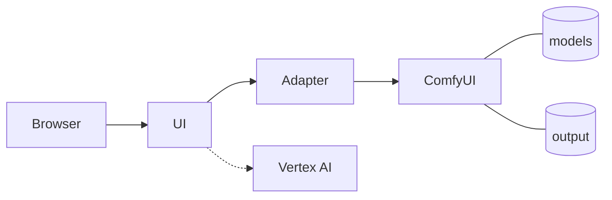
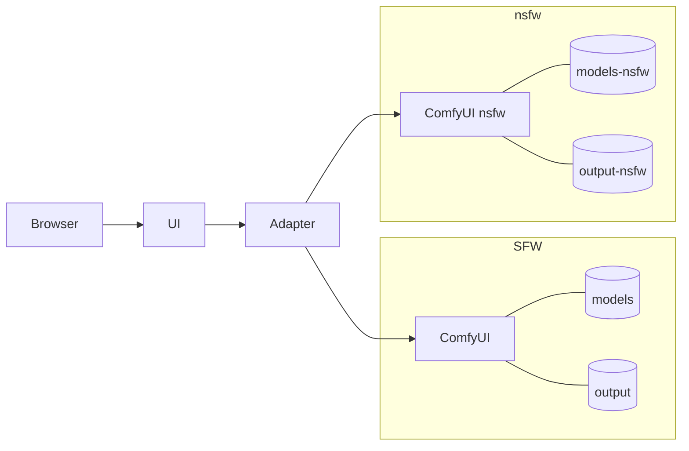
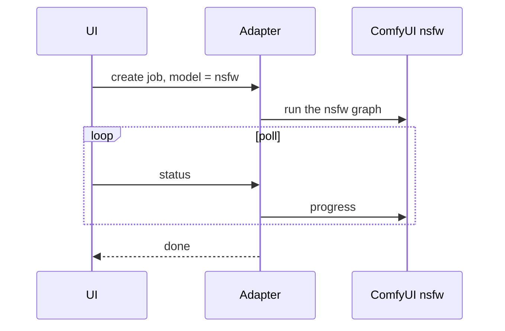

# SPIKE_001 — The NSFW model spike

**Epic:** none yet — the owner opens the epic once this spike has answered ("just do a spike ticket and research this… after that we will create an epic ticket", 2026-09-19 12:20 EDT); **EPIC_010** is the number it takes. The first ticket in `docs/spike/` (the owner, 13:05: "create a spike folder and put this in the spike folder instead of as a story"; CLAUDE.md §3f); in the shape of the earlier spikes [STORY_048](../story/STORY_048_the_gemini_spike.md) and [STORY_060](../story/STORY_060_fewer_cuts_at_the_join.md), which stay where they are.
**Status:** Approved (2026-09-19 16:04 EDT by the wall clock — the review round's stamps below (13:00–14:20) are approximate, written from the conversation's order, not the clock — "Ok this looks good, using the spike create the epic and then proceed with creating all the associated stories in order of implementation"; the epic is [EPIC_010](../epic/EPIC_010_an_nsfw_model_in_its_own_container.md). **The Spark half ran the night of 09-19/20 on STORY_063's container — 26 draws and the 30 s chain, the numbers in § Done note part 1; the judgement and the answer wait for the owner's review of the sheets.** The go (17:00 EDT — by the tool: build STORY_063 first, then the night; the photo at `spark/data/input/nsfw-reference.jpg`, a consenting adult by the owner's word; the prompts run unedited; the SFW container stopped for the night; a Civitai token added to the Spark's `.env` by the owner).** Second pass 13:15, reviewed 13:50–14:20): the **male-anatomy lens** added (13:08: "we really want to be good at naked male anatomy… whatever model is really good at that" — § Findings 4b, the matrix rewritten around it), the **current and proposed architecture with diagrams** (§ Architecture), and the **isolation intent** (13:12: "isolate the NSFW model as much as possible so that it's easier to debug… a docker container for the SFW vanilla variant, i.e. what we are using now, and an NSFW docker container"). The first pass's decisions (13:00, by the tool) stand: **its own container**, **the full matrix**, **an overnight budget**; the second review (13:50–14:00, by the tool) added: **a photo of a consenting adult** as the subject, **one container up at a time**, **the base weights copied into `models-nsfw/`** (14:10, over "shared read-only" of 14:00 — "isolation is worth it"), and **no LoRA-of-our-own backlog item until the matrix answers**; the stamp review (14:20): **the spike's draws in a throwaway nsfw container**, **a solo act for the motion prompt**, **the prompts by our own director skill run by the assistant**, **history as one list with a badge and a hide filter**. **Nothing runs until the owner says go** (13:05: "please do not implement anything yet") — and then only once he names the photo and the two prompts. Nothing in the product changes inside this spike.
**Estimate:** desk half ≈ 3 h (actual: 12:20 → 13:05 first pass, 13:08 → 13:45 second); Spark half ≈ 8 h of GPU for the male-anatomy matrix at two seeds (§ Estimated Complexity; the owner's budget is overnight) plus ≈ 1 h to read the strips and write the note · **Estimated completion:** the morning after the owner's go
**Created:** 2026-09-19

As the owner, I want to know which adult-content ("NSFW") variant of MiniMax-H3 the community actually runs and rates best — **and above all which one renders naked male anatomy well**, since that is what we care about most — whether our licence and our stack allow it, and, measured on our own box with the same photo, prompts and seeds under each candidate, which one to build the epic on; and I want the epic's architecture settled here: the NSFW model isolated in its own container beside the SFW one we run today, so that when something goes wrong it is obvious which half it is in.

## Current state (read from the files and the box, 2026-09-19 12:00–13:15 EDT)

- **The model on the Spark:** MiniMax-H3 FL2VA, `minimax_h3_fl2va_int8_convrot.safetensors` (34.0 GB, the **full, unpruned** int8 file — `ls -la spark/data/models/diffusion_models`, 12:35), with `minimax_h3_ref2va_int8_convrot` (34.0 GB) beside it, unused; the text encoder `qwen3vl_32b_minimax_h3_nvfp4_awq` (15 GB); ComfyUI v0.35.1 in `minimax-comfyui` (image `minimax-spark/comfyui:v0.35.1`, up 2 days, idle: `/queue` running 0 pending 0 at 12:30; **13.7 GiB resident while idle**, `docker stats` 13:13). `spark/data/models/loras/` is **empty**. `LoraLoaderModelOnly` is a core node and is present (`/object_info`, 12:30: inputs `model`, `lora_name`, `strength_model`).
- **How a checkpoint is chosen today:** the graph template `spark/comfyui/h3_t2v_prompt.json` names the file in its `unet` node; the adapter reads it back (`mapping.ts` › `templateUnet`) and `server.ts` verifies at start that ComfyUI lists it. There is no per-job checkpoint field and no LoRA node in the graph; `REQUIRED_CLASSES` (`mapping.ts:60`) is the whitelist a new node class must join. The adapter has **one upstream** (`COMFY_URL`, default `http://comfyui:8188`, `main.ts:19`) and **one template** (`GRAPH_TEMPLATE`); ComfyUI's own queue serialises the adapter's open jobs on the one GPU.
- **The box:** 121 GiB unified memory, **101 GiB available** with ComfyUI idle (`free -g`, 12:30); disk **993 GB free** of 3.7 TB (`df -h /`, 12:15); GPU 42 °C idle. The owner's ten other containers stay off (his instruction of 2026-09-13).
- **Every job today runs the SFW default**: 20 steps `res_multistep`/`simple`, 1344×768, the prompt in MiniMax's format with the single-shot sentence (STORY_020), extensions as masked continuation on the same checkpoint (STORY_017), the end-frame anchor (STORY_061, in flight). Those are the controls any variant is measured against.
- **Who can reach the UI:** the owner, on the LAN (README › Quick Start). The Telegram bot was withdrawn (CHORE_010). No third party generates anything on this box — which matters for the licence (§ Findings 1).

## UI Mockup

N/A (a spike: reading, a controlled comparison on the Spark, a written answer and a recommendation; the epic's stories carry the mockups — the switch in the composer, the mode in history, the model row in settings — once the epic exists).

## Acceptance Criteria

- [x] **The licence and the model card are read that day and quoted** — every clause of the MiniMax H3 Community License and its Exhibit A that bears on adult content, derivatives (LoRAs, merges), third-party access and "guardrails", and the model card's own Safety Guardrails paragraph — with the file and line, and a plain reading of what they permit on this box and what they would forbid if anyone but the owner could generate. (§ Findings 1.)
- [x] **The community's variants are ranked from the catalogues, not from memory**: Civitai (base model "MiniMax H3", the NSFW flag, sorted by downloads and by likes, through its public API — **all 472 entries scanned** in the second pass) and Hugging Face (the `not-for-all-audiences` / `nsfw` tags and a name search), plus the community's curated list; every candidate with its type (LoRA / merged checkpoint / text encoder), its base (FL2VA, Ref2VA, hybrid; pruned or full), its size, its author's own settings and its author's own stated limits; the write-ups sorted into **measured vs asserted**; **the male-anatomy adapters in their own table** with what each author trained on and admits to. Reddit's threads if reachable — and if not, that is said. (§ Findings 2–4.)
- [x] **The current and the proposed architecture, drawn** (Mermaid): what is shared and what is separate between the SFW container and the NSFW one, the memory arithmetic for running both, where the one-GPU rule lives, and the change the adapter, the contract and the UI each need. (§ Architecture.)
- [ ] **A controlled comparison on the Spark, built around male anatomy**: the same reference photo, the same two prompts and the same seeds under each candidate the owner picks (§ Decisions), every draw posted by the spike script to the **throwaway nsfw container** directly, the way STORY_060's lever 4 ran (the SFW container is stopped for the night, so nothing lands in the app's history — the strips and `run.md` are the record; never a product change); each draw's minutes (ComfyUI's clock), peak memory (`memwatch.sh`), `result.cuts`, the frame strip, and the owner's judgement on four questions per draw — *did it do what the prompt said*, *is the male anatomy right at rest* (shape, proportion, testicles, foreskin/glans as prompted, no extra or missing parts, no colour lines), *does it stay right in motion* (the "wobbly" failure the community names, melting, morphing between frames), and *would you keep it*. Then **one +10 s extension** on each of the top two conditions, to prove the variant survives STORY_017's masked continuation (and STORY_061's anchor). The matrix in § Findings 7.
- [ ] **The answer, in one paragraph**: which variant (stock + which LoRAs at which strengths, or which checkpoint), at what cost per clip against today's 17 min, whether a **male-anatomy LoRA of our own** is needed (§ Findings 4b's fallback), and what the epic's first stories are (§ Architecture › the epic's shape). And the **constraints the epic inherits** from the licence (§ Findings 1).
- [ ] **A budget the owner set** before the GPU runs — overnight (13:00); the story stops at it and reports what it has.

## Departures from the reference

- N/A — agent.minimax.io's hosted model moderates ("Content suspected of being … pornographic … may be blocked", the model card); ours does not. That is the whole point of the epic, and it is a departure the epic's stories will write under this heading, not this spike.

## Technical Notes

- **Where the files come from.** Hearmeman's LoRAs are mirrored on Hugging Face with SHA-256s matching Civitai (`Hearmeman/minimax-h3-loras`, public — a HEAD without a token answered 200 at 13:10), so `fetch-h3.sh`'s `hf` path works for them; NaughtyTimes v3 likewise (`SexGod1979/NaughtyTimes-MiniMax-H3`). Mystic XXX, Eros Max, the male-anatomy LoRAs and the rest live on Civitai only; a HEAD on their download URLs without a token answered **307** (a redirect, not a 401) at 13:10 — whether the redirect lands without sign-in is checked at go time; if it does not, `CIVITAI_TOKEN` goes in the Spark's `.env`, never in the repo or the transcript, the same rule as `HF_TOKEN` (CLAUDE.md §4b). Every file's SHA-256 (Civitai lists them) is checked after download.
- **A LoRA in the graph** is one node: `LoraLoaderModelOnly` between `unet` and `guider`/`sampler` with `lora_name` and `strength_model`; several stack in a chain. The spike's script edits the template by hand; the epic's story teaches `buildGraph` to insert them from the flavour and adds the class to `REQUIRED_CLASSES`.
- **A checkpoint swap** is the `unet_name` string; ComfyUI reloads the DiT on the next job (the README's "Queued…" row: a minute or two). Eros Max int8 is 20.5 GB (pruned-size) beside our 34 GB file — 993 GB free, no disk question.
- **Pruned vs full.** Comfy-Org ships `*_pruned_*` files 21 GB beside the full 34 GB int8; "pruned" strips the AdaLN projection modules (NaughtyTimes' README: its LoRA "was trained on the unpruned base model (won't likely work properly on pruned model)"). Eros Max and Real Dream are pruned-shaped (20.5 GB int8); ours is full. So NaughtyTimes goes on **our** file and not on Eros Max; Mystic XXX and Hearmeman's are used on both by their authors. (One author found the reverse — Worship It: "training on the non pruned version … did not work at all" — trainer-dependent, so every LoRA is judged on our file, not assumed.)
- **Some male LoRAs were trained against the int8 ConvRot checkpoint itself** (brand175's "[MinimaxH3] … INT8 Convrot" series). That is our precision; whether a LoRA trained on bf16 applies cleanly to int8 ConvRot is what ComfyUI's LoRA loader handles (it patches at load) — measured, not assumed.
- **The turbo question is separate.** Eros Max bakes a turbo delta in (8 steps); Hearmeman and NSFW Unlocked recommend 4–12 steps with the lightx2v turbo LoRA. Our baseline is 20 steps without turbo. The spike draws Eros Max **both** at its own 8-step recipe and at our 20, so the merge is judged apart from the speed-up; turbo on the stock model is its own backlog item if the owner wants it.
- **The director — our own skill, run by the assistant (the owner, 14:20: "why can't you use our current skills instead?").** `agents/skills/minimax-h3-director-thirst-trap/SKILL.md` is portable by its own frontmatter ("any agent that can read local files and view the attached image; no tools, network access or runtime required"), and the assistant ran it by hand in the cove and office rounds before the Vertex director existed (STORY_048 › Current state). So at go time, once the owner names the photo, **the assistant runs the skill on it twice** — once per brief — and every rule carries over unchanged: the Workflow's inventory of the frame, the 400–600-word description, the single-shot / object / persistence rules, the HOOK → SETUP → CLIMAX → HOLD beats, the soundscape, the checklist. Only the **Task paragraph** (the genre) is swapped for the spike's two briefs — **P1 at rest**: the man undresses fully and turns so the genital, buttocks and chest are each seen, no act; **P2 solo**: a solo act that keeps the genital in frame and moving — and the camera sentence's "ten-second duration" reads five seconds, the beats compressed to match the matrix's 5 s draws. The two prompts go into `run.md` and this ticket's Done note, and the owner edits them before the first draw if he wants to. EPIC_009's Vertex director is not used (an adult prompt would be refused there — STORY_048's refusal shape); **the epic's prompt story is a sibling skill in CHORE_012's pattern, `minimax-h3-director-<genre>`, with the genre the owner names**, run by the assistant or a local model, never Vertex.
- **The spike's draws run in a throwaway nsfw container, never in the SFW one (the owner, 14:20).** A compose override under the untracked `test/` directory (nothing under `spark/` changes): the same image `minimax-spark/comfyui:v0.35.1`, container `minimax-comfyui-nsfw-spike`, port 127.0.0.1:8189, `spark/data/models-nsfw/` (the base files copied from `models/` — fl2va int8, the text encoder, the two VAEs, 54.5 GB, checksums compared — plus the LoRAs and Eros Max) and `spark/data/output-nsfw/`; the SFW container is stopped first with `stop.sh` (one at a time) and started again with `run.sh` when the night is over; the spike script posts graphs to 8189 directly (STORY_060's method) and `memwatch.sh` watches the box. The SFW `models/` directory is never written to. The container is a preview of the epic's; the epic's compose story replaces the override with the real profile.

## Testing Plan

- **Unit / integration / e2e — none**: the spike changes no product code; the epic's stories bring the tests for the model field, the graph builder, the second upstream, the switch and the history mode. Said so, as STORY_048 and STORY_060 did.
- **Manual verification (the Spark, in the Done note with the date, the files' names and SHA-256s, the seeds and the job ids)**: the matrix of § Findings 7, every draw with its strip under `spark/data/smoke/`, its minutes and its peak memory; the owner's four judgements per draw in a table; the two extensions' `result.cuts` and seam ratios; and, if the owner says so, the second container's idle memory and a draw with both containers up (§ Architecture › memory).

## Estimated Complexity

Small in code (a spike script, a hand-edited graph), medium in reading (done), **large in GPU**: a 5 s image-to-video draw is ≈ 17 min on the README's table. The male-anatomy matrix is nine conditions (§ Findings 7): nine × two seeds × two prompts ≈ 36 draws ≈ **10 h**; at one prompt ≈ 5 h; plus Eros Max's 8-step draws (shorter), two checkpoint loads and two +10 s extensions (≈ 67 min each). Before the first draw: the base files copied into `models-nsfw/` (54.5 GB, minutes on the NVMe), the LoRAs fetched and checked, the throwaway container started and verified — under an hour. The owner's budget is overnight (13:00): the two-prompt, two-seed matrix fits a night if it starts by 20:00; three seeds do not, and the Done note says which seeds ran.

---

## Architecture

### Today (read from `compose.yaml`, `spark/comfyui/compose.yaml`, `spark/adapter/src/main.ts`, README › Architecture, 13:10)

| Box | Container · port | What it is | Reads / writes |
| --- | --- | --- | --- |
| UI | `minimax-app` · 3000 | the video generation screen (`compose.yaml`) | `history.json`, `queue.json`, `projects.json`; `MODEL_BASE_URL = http://adapter:4020` |
| Adapter | `minimax-adapter` · 4020 | the job API: `POST /jobs`, `GET /jobs/:id`, `/result`, `/capabilities` (`spark/comfyui/compose.yaml`) | **one** upstream `COMFY_URL = http://comfyui:8188`; **one** template `h3_t2v_prompt.json`; `jobs.json` |
| ComfyUI | `minimax-comfyui` · 8188 | ComfyUI v0.35.1 on the GPU; its own queue serialises the jobs | 13.7 GiB resident idle, 64–97 GiB drawing |
| models | `spark/data/models/` | fl2va int8 34 GB, ref2va int8 34 GB, text encoder 15 GB, two VAEs; `loras/` empty | bind mount, read-write |
| output | `spark/data/output/` | the videos and posters; `adapter/`, `logs/` beside it | bind mount |
| Vertex AI | — | Gemini, the director (EPIC_009), agent mode only | — |

One UI, one adapter, one ComfyUI, one models directory, one output directory, one graph template. Everything a job needs is decided by the adapter from that one template; ComfyUI is a workflow engine with a queue, and the GPU rule ("one generation at a time") is ComfyUI's own queue.

### Proposed — the SFW container untouched, the NSFW model in its own (the owner's decision, 13:00 and 13:12)

**What is separate, and why it makes the NSFW half debuggable on its own:**

| Piece | SFW | NSFW | So that… |
| --- | --- | --- | --- |
| Container, name, port | `minimax-comfyui` :8188 | `minimax-comfyui-nsfw` :8189 | `docker logs minimax-comfyui-nsfw` is only its log; it can be stopped, rebuilt or removed with the SFW one running |
| Image tag | `minimax-spark/comfyui:v0.35.1` (pinned, unchanged) | the same Dockerfile, its own tag (`COMFYUI_TAG_NSFW`); today identical | a custom node, a ComfyUI bump or a patch a variant needs never enters the image the gate and the SFW flow depend on |
| Model files | `models/` (as today) | `models-nsfw/` as its **whole** models directory: **its own copy** of the base files the nsfw graph loads (fl2va int8 34 GB, the text encoder 15 GB, the two VAEs 5.5 GB — 54.5 GB, copied locally in minutes; ref2va's 34 GB only if a Ref2VA variant is ever wanted) plus the LoRAs and any merged checkpoint, every file on a SHA-256 list (the owner, 14:10: "isolation is worth it") | **nothing is mounted from the SFW side**; the nsfw container can be moved, rebuilt or deleted with its whole models directory, and the SFW files are never opened by it |
| Output, logs | `output/` | `output-nsfw/`, its own `logs/` | adult videos and their posters never sit in the SFW directory; a corrupt file is findable by directory |
| Graph template | `h3_t2v_prompt.json` (unchanged) | `h3_nsfw_prompt.json`: the checkpoint, the LoRA chain with strengths, the sampler settings | a bad LoRA strength or a sampler change is one file, diffable |
| Job API | one adapter, `model: minimax-h3` (the default) | the same adapter, `model: minimax-h3-nsfw` | one job store, one history, one queue; the adapter probes both upstreams and refuses (or the app's queue holds) a job whose server is not the one up; its log lines carry the job id and the upstream |
| Start/stop | `run.sh` / `stop.sh` (as today) | `run.sh --nsfw` / `stop.sh --nsfw` (a compose **profile** `nsfw`); `verify.sh --nsfw` for its health | **one at a time** (the owner, 14:00): `run.sh --nsfw` stops the SFW container first and the reverse; "which is running" is one `docker ps` |

**Why one adapter and not two.** The GPU is one, and the rule "one generation at a time" must live in exactly one place. With one container up at a time that place stays where it is today — ComfyUI's own queue — and the adapter's only new duty is to know **which** upstream is up and to say so in `capabilities`. Two adapters would mean two job stores, two histories and a UI that talks to two servers, for no isolation gain below the adapter. Everything below the adapter is separate; the adapter is our own TypeScript, unit- and integration-tested against the stub, and its log names the upstream on every line. (If both containers are ever allowed up at once — a later story — the rule moves into the adapter as a single GPU slot; two adapters could never share one.)

**A job in NSFW mode:**

The SFW container is stopped the whole time (one up at a time). A job for the container that is down is refused with a clear message, or held by the app's queue.

**Memory: can both containers stay up?** Measured today: the SFW container holds **13.7 GiB while idle** (`docker stats`, 13:13); a 5 s draw peaks at 64 GiB, a 10 s image-to-video at 71, a +10 s extension of a 10 s source at 89, and the worst measured case (a +10 s extension of a 20.75 s source) at **96.7 GiB** (README's table). So with both containers up and one drawing: ≈ 14 + 64 = 78 GiB for a 5 s clip, ≈ 14 + 89 = 103 for the common extension, ≈ 14 + 97 = **111 GiB of 121** for the worst one — that last fits on paper only, with 16 GiB of swap behind it. **Recommendation for the epic (revised 13:55 after the owner's questions, § Decisions 5):** **one container at a time** as the first shape — `stop.sh` one, `run.sh` the other; the container's start is seconds to a minute and the model loads (text encoder ≈ 7 s, DiT 51 s — STORY_005) happen on the first job either way, so a switch costs about a minute and nothing in memory, and ComfyUI's own queue stays the one-GPU rule for whichever is up. The adapter then needs only to know which upstream is up (it probes both and reports it in `capabilities`), and the **GPU slot becomes a later story** for "both up" — which the memory allows for every measured job but the worst extension, and which row 11 of the matrix measures so that story starts from a number.

**What each layer changes (the epic's shape — three or four stories, named after the spike answers):**

1. **The adapter: a second upstream** — `COMFY_URL_NSFW`, `GRAPH_TEMPLATE_NSFW`, `OUTPUT_DIR_NSFW`; the adapter probes both and `capabilities.models` lists `{ id: "minimax-h3-nsfw", label: "MiniMax-H3 (uncensored)" }` only while that server answers (one at a time, so at most one of the two is listed as ready); a job's `model` picks the upstream and the template, and a job for the server that is down is refused with a clear message or held by the app's queue; `buildGraph` inserts the LoRA chain from the template; the contract bumps to v1.6 (the `model` field already exists — nothing breaks for an older client). Unit (mapping, the upstream choice), integration (the stub plays two servers). *A GPU slot across both upstreams is a later story, only if both are ever allowed up at once.*
2. **The compose profile and the scripts** — service `comfyui-nsfw` (same build, `COMFYUI_TAG_NSFW`, port 8189, `models-nsfw/` mounted as its whole models directory, `output-nsfw/`), `run.sh --nsfw` (stops the SFW container first, and the reverse), `stop.sh --nsfw`, `verify.sh --nsfw`, `fetch-nsfw.sh`: the base files **copied locally** from `models/` (never re-downloaded) and the LoRAs fetched, every file checked against a SHA-256 list. Shell lint through the shellcheck image, as today.
3. **The UI: the switch and the mode** — the composer's switch (off by default, remembered per task), the job's `model`, the history and inbox badge, a filter to hide adult entries, the Scheduled page's queue rows saying which server they wait for; an extension inherits its source's model (the contract already requires `model` to equal the source's). Component tests in StrictMode, e2e against the stub with a second model in its capabilities.
4. **(If the spike says so) the male-anatomy LoRA of our own** — a backlog item first (§ Findings 4b).

## Findings — the desk half (2026-09-19, 12:00–13:45 EDT)

### 1. The licence and the guardrails (read from the repo's copies, 12:00)

`docs/references/raw/LICENSE_MiniMax-H3.txt` (the MiniMax H3 Community License Agreement, dated 2026-08-02, fetched from `huggingface.co/MiniMaxAI/MiniMax-H3` — the references README, row 24):

| Clause | Line | What it says | Reading for this box |
| --- | --- | --- | --- |
| Definitions §5 | 10 | "Excluded Territories" means the EU, the UK, the Republic of Korea and the United States | El Salvador is not one (EPIC_004 decision #1, 2026-09-12); unchanged |
| Definitions §11 | 20 | "Model Derivatives" means … any modification of MiniMax H3 … any work based on MiniMax H3 | **every LoRA and every merge below is a Model Derivative** and carries Exhibit A whatever its own README says (SexGod1979's repos declare Apache-2.0; Hearmeman's declares the Community License) |
| Grant §II | 22 | a licence to "use, reproduce, distribute, create derivative works (including Model Derivatives), and modify" within the Applicable Territory | LoRAs and merges are permitted works — **including one we train ourselves** |
| Use Restrictions §V.2 | 40 | "Before providing access to the MiniMax H3 Works or any product, service, or Hosted Service incorporating them, you must bind each recipient or user to enforceable terms at least as protective" | applies only when someone other than the licensee uses the product — nobody does today |
| §V.3 | 41 | "You may not use the MiniMax H3 Works or any of their Outputs or results to improve any other artificial intelligence model (other than MiniMax H3 or its Model Derivatives)" | training a LoRA **for H3** on H3's outputs is inside the exception; feeding them to another model is not |
| §V.5 | 43 | "If you provide or make available to any Third Party a product, service, or Hosted Service that permits the generation of Outputs … you must … implement, maintain, test, and periodically review reasonable and proportionate technical and organizational safeguards" | **the constraint the epic inherits**: the NSFW model must never be reachable by a third-party surface (a bot, a shared LAN login) without these safeguards — today there is none |
| §VI.1, §VI.4 | 47, 51 | "you will own the derivative works and modifications … as well as any Model Derivatives"; "MiniMax claims no rights over the Outputs you generate. You and your users are entirely responsible for the Outputs" | a LoRA of ours is ours; the outputs are the owner's responsibility, in writing |
| Exhibit A §1–§20 | 64–84 | the Acceptable Use Policy | **no clause names sexual, adult or pornographic content**; the ones that bear: §2 lawful use and third-party IP; §5 "circumvent or bypass any safety guardrails or safeguards we have implemented"; §6 "exploits or harms, or intends to exploit or harm, minors"; §12 disclose machine generation when posting in public; §13 "impersonate another person without that person's consent"; §15 "violates or disregards the social, ethical, or moral standards of other countries or regions" (the vague one) |

The model card (`raw/model-card_MiniMaxAI_MiniMax-H3.md`, line 98–100, **Safety Guardrails**): "User-submitted text, images and videos, as well as enhanced prompts, are subject to automated moderation. Content suspected of being unlawful, pornographic, or infringing third-party rights may be blocked. We use industry-standard filtering measures but cannot eliminate false positives or false negatives. These guardrails do not affect the Licensee's obligations under the MiniMax H3 Community License." — that paragraph describes **the hosted service's** moderation; the open weights ship no classifier, no filter node and no refusal step (nothing in the model card, the Comfy-Org card or the ComfyUI nodes we run implements one — STORY_005 read all three). So running the weights locally without the hosted filter is what the licence's local grant is, not a "bypass" under Exhibit A §5; what §5 plainly does cover is disabling a safeguard one has implemented under §V.5 for third parties.

**Reading (not legal advice — the owner decides):** adult content for the owner's own use on his own box, with reference photos of consenting adults, is within the grant; the licence's bite is (a) minors (§6 and the law — absolute), (b) real people without consent (§13 — a reference photo of someone who has not agreed to be depicted this way), (c) posting outputs publicly without disclosure (§12), and (d) any third party generating on this box (§V.2/V.5). The epic writes (a)–(d) as constraints in its own Goal, and the NSFW model stays owner-only until a story adds the V.5 safeguards.

### 2. Does the stock model already do it? (measured vs asserted)

| Source | Date | Measured or asserted |
| --- | --- | --- |
| Atom Tan Studio on X (reported by the search tool; X is not fetchable from here) | 2026-08 | **asserts** "Minimax H3 is completely uncensored if you provide the image" — one person, no count |
| Kingy AI, "Can MiniMax H3 Generate Uncensored Video?" (read through the fetch tool) | 2026-08-04, updated 09-07 | **asserts** local H3 is "relatively permissive or largely free of the hosted moderation layer"; explicitly **does not test** nudity, acts or anatomy: "the exact boundary is not publicly documented or stable"; names no fine-tunes |
| Medium, "Uncensored Video Generation using MiniMax H3" | 2026-08 | not readable (403); not counted |
| The LoRA authors, on their own model pages (Civitai, read 12:05–13:30) | 08–09/2026 | **measured in the only sense available** — they trained against the base and say where it fails: Plaguekind (Tiddies slider): "any actions seen in samples are of base model capability … H3 likes putting lines of different colored skin on breasts by default"; Hearmeman (AIO V2): "I2V works really well … T2V is not there yet … Main issue is deformed genitalia"; alcaitiff (Mystic XXX): "Finally, text-to-video with proper anatomy"; tenstrip (Eros Max): "For t2v and even some i2v you should 100% be loading mystic_v4, anatomy enhancer, or a related concept lora on top"; **on male anatomy specifically** — Dr_P3rV (Johny Mamba): "since H3 came out … porn actually looked a bit crippled … our proud genitals were sometimes looking a bit… H3 seems to think that a penis is quite wobbly"; DomDomTomTom's adapter is named "Mini Dick Fix — Penis Helper"; Hearmeman (HMPenis): "Dataset is pretty thin" |

**Reading:** the stock FL2VA renders nudity and sexual motion from an image without refusing — nobody online reports a refusal — and its weaknesses are **genital anatomy** and **explicit motion**, worst in text-to-video, better in image-to-video. **For male anatomy the community's own words are "crippled", "wobbly" and "mini"**: the base renders the male genital small, unstable in motion and inconsistently shaped, which is exactly what the male adapters in § 4b were trained to fix. So condition 0 of the matrix (stock, no LoRA) is a real candidate for nudity at rest, and almost certainly not the answer for male anatomy in motion.

### 3. The catalogue (Civitai's public API, base model "MiniMax H3", NSFW-flagged; Hugging Face's API; 12:05–13:30 EDT)

Reddit could not be read this session: reddit.com refuses the search crawler and the Spark's direct fetches (three routes tried: the JSON search, old.reddit, the pullpush archive). The consensus proxy is therefore **downloads and thumbs-up on Civitai**, where every author publishes (the second pass scanned all 472 H3 LoRA and checkpoint entries, 13:25), plus the community's curated list (`wildminder/awesome-minimax-H3`, `blocks/35_loras.md`, read 12:30).

**A. General NSFW LoRAs on the stock checkpoint** (no swap; a file of 80 MB to 1.2 GB in `models/loras/`)

| LoRA | Author | Downloads | Likes | Version, date | Size | Base | What it is (the author's words) | The author's settings |
| --- | --- | --- | --- | --- | --- | --- | --- | --- |
| [MMH3] Mystic XXX | alcaitiff | 80,353 | 2,438 | v4.0, 2026-08-25 | 150 MB (+ a 130 MB Ref2VA file) | FL2VA and Ref2VA | "Unlock Real Anatomy in T2V … Works great with T2V, I2V and FFLF"; v4 trained at higher resolution with musubi-tuner, "the best overall balance of motion quality, temporal stability, and fine detail" | strength 1.0 (0.2–1); "Turbo LoRAs can change the look" |
| HMNSFW — AIO Sex LoRA | HearmemanAI | 60,899 | 1,686 | V2.5, 2026-08-26 | 86 MB | FL2VA (I2V + T2V) | "close to 1000 videos … penetration, handjobs, blowjobs, fingering, dildo riding, cumshots"; "not a plug and play solution that always works"; trigger `hmmotion` | Euler / simple, 12 steps, shift 6, turbo LoRA 0.5; strength 0.5–0.9 |
| VBVR Pro (video reasoning) | MisticRain69 | 60,830 | 2,104 | H3 VBVR Pro, 2026-09-07 | 100 MB | FL2VA | a prompt-following booster trained on the VBVR-Pro SFT set, "works on non NSFW as well"; the author's own NSFW LoRA (MisticNSFW) is unreleased | 1.0; 0.5 on top of Eros Max |
| SexGod's NaughtyTimes | sexgod1979 | 30,322 | 771 | v3.0 unpruned, 2026-09-07 | 1.23 GB (568 MB pruned) | FL2VA, **unpruned only** | rank 64, "trained on the unpruned base … the pruned version has the adaln proj stripped"; T2V+I2V 50/50; the training captions include "cock, penis" beside the female terms; "just an extracted rank64 (retains 98%)" of the PinkCherry fine-tune — the author says the LoRA on stock int8/bf16 beats his own checkpoint | Euler / simple (**not** res_multistep), 30–40 steps, 1.0, ≥ 0.7 MP; turbo untested |
| Astro NSFW | astronopor | 2,705 | 115 | v1.0, 2026-08-28 | 300 MB | — | 5,000 clips, "improving human movement and anatomy"; 30 % hand-tagged | no trigger |
| MiniMax H3 NSFW Unlocked | The_Midnight_Lab | 6,329 | 388 | M3_V1, 2026-09-16 | 200 MB | I2V + T2V | "completely removes generation guardrails" (marketing — see § 1: there is no guardrail in the weights); nude/topless, breast physics, kissing, caressing — female-centred | euler_ancestral, 4–8 steps with turbo, "CFG 1"; 0.3–1 |
| Tiddies and Realism Slider · Better NSFW motion (Ref2VA) · AfterMidnight (Ref2VA) · Bouncing Boobs · Daring's Deepthroat · the single-act LoRAs | various | 1k–180k | — | 08–09/2026 | — | female-centred or act-specific; Ref2VA ones do not fit our FL2VA graph | — |

**B. Merged / fine-tuned checkpoints** (a swap of the 34 GB file)

| Checkpoint | Author | Downloads | Likes | Version, date | Files | Base | What it is (the author's words) | Settings | What users report |
| --- | --- | --- | --- | --- | --- | --- | --- | --- | --- |
| **H3 Eros Max** ("10Eros") | tenstrip | 29,825 (beta5 11,767) | 1,331 | beta5, 2026-09-07 | int8 20.5 GB (TURBO-hybrid and non-turbo), fp8 13.7 GB; beta4 bf16 39.3 GB | **hybrid** FL2VA/Ref2VA, **pruned-size** | "built off 7 different concept-grouped grafts and consensus merges from over 20 Loras, no full direct lora merges"; "The files with TURBO have a hybrid turbo-delta fusion baked in"; "Prompt is the entire key to quality and success … Describe things cleanly and literally"; per the archive, "not dedicated to NSFW as that would violate community license agreement" | er_sde/beta57 4–6 steps, res_multistep/simple 6–9, LCM/simple 6–8; concept LoRAs on top at 0.2–0.6; "for t2v … 100% be loading mystic_v4 [or an] anatomy enhancer … on top" | archive comments (civitaiarchive, read 12:35): better prompt adherence than beta4; greasy skin; genital inconsistencies; strips clothing on its own; camera drift; audio artefacts in the turbo files; a larger-breast bias whatever the prompt; "a very strong vaginal sex bias" — **female-centred by its users' account** |
| PinkCherry MM H3 fl2va | sexgod1979 | 14,374 (v1 1,158) | 679 | v1.0, 2026-09-07 | **bf16/fp16 64.7 GB only** for v1 | FL2VA, unpruned | the fine-tune NaughtyTimes was extracted from; the author: "no benefit in me posting an int8 version … as it would be worse than the lora" | Euler / simple, 30–40 steps | — |
| MiniMax H3 Remix | FX_FeiHou | 6,634 | 272 | v0.6, 2026-08-22/23 | int8 33.2 GB, bf16 64.7 GB | dual-H3 layer recombination, turbo fused | an **artistic** merge; "NSFW content allowed" is a property of the *workflow* it ships, not a training claim; needs the author's custom node packs | 8–12 steps, no extra LoRAs | — |
| 10eros_Max ref2va int8 · Real Dream H3 V1 · Dark Beast H3 | Stuubzzz · sinatra · AiMetatron | 4,248 · 84 · paid | 165 · 72 · 235 | 08–09/2026 | int8 | Eros Max on Ref2VA; general-realism merges, not adult-trained; a paid 2K pipeline | — | **out** |

**C. The text encoder** (`models/text_encoders/`, a drop-in for our `nvfp4_awq` file)

| File | Author | Size | Claim | The counter-claim |
| --- | --- | --- | --- | --- |
| Qwen3-VL-32B Ultra-Heretic H3 (int8 ConvRot / bf16) | ethanfel | 24.55 GB / 47.97 GB | "bypasses alignment/restriction layers in the text encoder so MiniMax-H3 receives the most faithful prompt embeddings" (the curated list's wording) | InstaSD's text-encoder guide (page returns 403 to the fetch tool; quoted through the search tool's summary — **not read in full**): the Heretic author himself says abliterated encoders **do nothing for H3** — the encoder hands its layer-49 hidden states to the DiT and never generates, so a refusal never happens; "a heretic encoder hands the DiT a slightly shoved version of the same representation … worst case, you lose prompt adherence and pick up artifacts" |
| the same, NVFP4 · GGUF | sakamakismile · pottokao | 15.7 GB · 12.65 GB | "drop-in replacement" | their only measurements are about quantisation, not adult output |

**Reading:** the stock encoder's tokenizer and embeddings handle explicit words like any others; the "uncensored encoder" is community folklore that its own toolmaker disowns. **Not a candidate.** At most one A/B at the end of the matrix if the owner wants the myth settled on our box.

### 4. The reading — what the community actually runs (general)

- **The most-downloaded and most-liked adult variant of any kind is a LoRA on the stock checkpoint** — Mystic XXX v4 (80 k / 2.4 k), then Hearmeman's AIO (61 k / 1.7 k) with his anatomy set under it, then VBVR (61 k / 2.1 k). Every author of a merged checkpoint tells you to load one of these on top anyway.
- **The most-downloaded adult checkpoint**, Eros Max (30 k / 1.3 k), is a merge of those same LoRAs, pruned-shaped, turbo-baked, and **female-biased by its own users' account**. It buys convenience and speed, not a different model.
- **Every author says the same two things:** the prompt is everything, and **image-to-video beats text-to-video** for anatomy. Both match how this workstation already works.

### 4b. Male anatomy — what exists (the full catalogue scanned 13:25; the pages read 13:20–13:35)

The catalogue is female-centred: of the 472 H3 entries, the adapters whose text is mostly about male anatomy number about twenty-five, and the biggest of them has a quarter of Mystic XXX's downloads. What there is:

| LoRA | Author | Downloads | Likes | Version, date | Size | Mode | What the author says | Settings |
| --- | --- | --- | --- | --- | --- | --- | --- | --- |
| **HMPenis — Penis/Cock LoRA** | HearmemanAI | 23,298 | 589 | v2.0, 2026-08-20 | 78 MB | stills-trained (anatomy); stacks under the action LoRAs | "Trigger is HMPenis. Lead with it. Dataset is pretty thin … It works well with medium-large sized cocks. Specify the direction in the prompt: Front (Like a POV angle) Back Side. Use words like: Large, circumcised, glans with color adjectives"; v2 "renders better penises"; v2's trigger `penis` | 0.9–1.0 (the collection's note: 0.9) |
| **Penis Lora — H3** | misterxrex | 8,499 | 314 | v1.1, 2026-08-29 | — | I2V/T2V | triggers `PENISLORA`, "Cinematic Realism, stroking, blowjob, cum, testicles, frontal, side view, from above, hand job, deepthroat" — the broadest male-genital adapter by its own caption list | — |
| **Male Anatomy — Ass, Penis, Testicles and Glans** | diogod | 5,502 | 279 | v2.02, 2026-08-22 | — | — | **the one adapter named for the whole male body below the waist**: `asshole, ass, anus gap, penis, glans, testicles`; foreskin in its text | 0.4–1.5 |
| Mini Dick Fix — Penis Helper (T2V) | DomDomTomTom | 6,875 | 294 | v1.0, 2026-08-07 | — | T2V | a size/shape corrector; trigger `3r3kt` "but not really needed" | — |
| [MinimaxH3] Licking Penis and Testicles — **INT8 Convrot** | brand175 | 7,822 | 293 | v1.0, 2026-08-25 | — | I2V | trained against the int8 ConvRot checkpoint (ours); "Only works if penis and testicles are…" (visible in the frame) | — |
| PornMaster MMH3 Side View of Penis (I2V) · POV Large Penis · front view erect | iamddtla | 3,881 · 61 · 39 | 203 · 61 · 48 | 08/2026 | — | I2V | "the side view of a man's erect penis, prominent penile veins. His test[icles]…" — one angle each | — |
| Flaccid VTX — Flaccid Uncut Penis | jouhellerxxx391 | 3,125 | 168 | v1.0, 2026-08-10 | — | — | the flaccid, uncircumcised case the others do not cover | — |
| Gay NSFW model for minimax h3 | Xabsurd | 1,996 | 112 | anal-v1-384, 2026-09-06 | — | — | male–male; trained at **384 px** (the version name); "muscular" in its text | — |
| muscular bodybuilder for minimax h3 · Muscle Growth · Body Growth/Expansion | Xabsurd · darkroast · cruffsant461 | 251 · 252 · 8,295 | 39 · 26 · 486 | 08–09/2026 | — | — | the male **body** (not genital) adapters: musculature, growth | — |
| Jerking Off · Minimax-H3 Male-Malesuck · Dialectical love (gay I2V) · Yaoi (anime) | kermitfrog1202 · coldwood · Boccp · Hinori | 1,568 · 627 · 4,181 · 785 | 88 · 39 · 167 · 81 | 08–09/2026 | — | I2V | male-centred acts; Yaoi is anime-only | — |
| H3 Johny Mamba | Dr_P3rV | 1,324 | 57 | v1.0, 2026-08-29 | 290 MB | — | 42 stills; "H3 seems to think that a penis is quite wobbly, try to adjust in the prompts"; pairs with kermitfrog1202's Blowjob v3 | 1.0 |
| CoachBate's set: Penis LoRA v1 · Uncut Penis v2 · Gay Sex (preview) · Arousal Hyper Penis XXL | coachbate | 365 · 199 · 97 · 52 | 135 · 120 · 41 | 08/2026 | — | — | a male-only creator; likes out of proportion to downloads (early access) | — |
| HMCumshot v1.0 (an action LoRA, for reference) | HearmemanAI | 29,430 | 903 | 2026-09-15 | 300 MB | I2V/T2V/R2V | "Much better cum texture and **penis texture**" — an action adapter that improves the male genital as a side effect | 0.7; Euler/simple, shift 6, turbo 0.85 |

**Reading, male anatomy:**

- **There is no male equivalent of Mystic XXX or Eros Max** — no widely used adapter trained on thousands of clips of male bodies, and no merged checkpoint. The dedicated male adapters are **single-author, small-dataset** (HMPenis "pretty thin", Johny Mamba 42 stills, Xabsurd's at 384 px) and mostly **genital-only, often one angle**. The male **body** adapters (musculature, growth) are tiny.
- **The likeliest good stack for a naked man, from the authors' own words: stock FL2VA + Mystic XXX (general anatomy and stability) + HMPenis or diogod's Male Anatomy (the genital), with the act LoRA the prompt needs on top** (HMCumshot, Penis Lora's acts, Blowjob v3); NaughtyTimes as the one general adapter whose captions name the male genital and whose author swears by the unpruned file we run. Which of HMPenis, Penis Lora and diogod's is best is **not knowable from the catalogue** — their download counts are within a factor of four and every page admits limits — so **the matrix draws all three on the same seeds**.
- **The "wobbly" problem is a motion problem**, and no author claims to have solved it: it is what the matrix's third judgement (right *in motion*) measures, and what an extension test must survive.
- **The fallback the epic should expect: a male-anatomy LoRA of our own.** The tooling exists and is documented: MiniMax's model card has no trainer, but the community does — ai-toolkit trains H3 LoRAs at **12.7–20.6 GB peak** (rank 16, batch 1, gradient checkpointing; "about 6 to 7 hours for 1000 steps" on a 12 GB RTX 4070 — a Japanese guide, 2026-08; a 24 GB-card guide at Inline Studio; DiffSynth-Studio's issue #1624 on minimum training memory), musubi-tuner trained Mystic XXX v4, and a ~150-line Diffusers trainer with latent caching was published on the model's own discussion board (discussion #27, 2026-08-03 → 08-11, `IAmIronMan42/MiniMax-H3-FineTuning`, "lr ≤ 1e-5"). The Spark's 121 GiB is far above any of those peaks; **its speed for training on a GB10 is unmeasured** and the tooling's aarch64/cu130 fit is unverified — a **backlog item** that the spike's answer either promotes or closes, never a claim. Licence: a LoRA trained on H3 for H3 is a Model Derivative the owner owns (§VI.1) and inside §V.3's exception; the training material must be the owner's to use (Exhibit A §2, §13).

### 5. Fit with our stack

| Candidate | What changes in the NSFW graph | Memory | Extensions (STORY_017) |
| --- | --- | --- | --- |
| LoRAs on stock | one `LoraLoaderModelOnly` per LoRA between `unet` and the guider; the list and strengths in the nsfw template | patched into the 34 GB DiT at load — a few hundred MB, no change to the 64–97 GiB peaks | the same graph, so a LoRA applies to an extension by construction — **proved by the matrix's two extensions** |
| Eros Max (int8, 20.5 GB) | `unet_name` in the nsfw template | pruned-size: **smaller** than today's 34 GB at load | it is a *hybrid*: whether FL2VA's first/last-frame inputs and our masked continuation behave on it is **unknown until drawn** |
| NaughtyTimes | as LoRAs, but Euler/simple at 30–40 steps per its author — sampler settings are per-template | as LoRAs | as LoRAs |
| Heretic encoder | `clip_name` in the nsfw template | the same 15.7 GB | — |

### 6. Its own container — the decision and what it buys

The owner's decision (13:00, confirmed 13:12): **a container for the SFW variant, exactly what runs today, and a separate container for the NSFW model, isolated as far as possible so that a fault is obviously in one half or the other.** § Architecture draws it. What the isolation buys, concretely: separate logs, a separate image tag (a node pack or a ComfyUI bump for a variant never touches the pinned SFW image), separate model and output directories (the base files copied into `models-nsfw/`, so nothing is mounted from the SFW side — the owner, 14:10), a separate graph template, a separate port, its own start/stop/verify — and the SFW container and its gate stay byte-for-byte what they are today. What it costs, after the owner's choices of 14:00–14:10 (**one at a time**, the base weights **copied into `models-nsfw/`**): **54.5 GB of disk** (993 GB free) copied once in minutes, **about a minute of container start per switch** and nothing in memory — the model loads happen on the first job either way — and an adapter that knows which upstream is up (§ Architecture › memory, § Decisions 5–6). The first pass's alternative (one ComfyUI, a per-job flavour) is recorded there and closed.

### 7. The Spark half — the matrix proposed (rewritten around male anatomy)

The same reference photo — **a photo of a consenting adult** that the owner names at go time (§ Findings 1 (b); his answer of 13:50) — and two prompts **written by the assistant with the thirst-trap director skill, its Task paragraph swapped** (Technical Notes › The director), literal and temporally ordered, in the ticket before the first draw: **(P1) at rest** — the man undresses fully and turns so the genital, buttocks and chest are each seen, no act (the anatomy test); **(P2) solo** — a solo act that keeps the male genital in frame and moving (the "wobbly" test; the owner, 14:20: solo — one subject, so only the anatomy adapters are exercised). **5 s at 1344×768**, the same seeds under every condition, **every draw in the throwaway nsfw container** (Technical Notes):

| # | Condition | Sampler / steps | Files to fetch |
| --- | --- | --- | --- |
| 0 | stock FL2VA, no LoRA (the control — and a candidate for P1) | res_multistep / simple, 20 | none |
| 1 | stock + Mystic XXX v4 @ 1.0 | same | 150 MB |
| 2 | stock + Mystic XXX @ 1.0 + **HMPenis v2** @ 0.9, `penis` in the prompt | same | + 78 MB (Hugging Face mirror, SHA-256 checked) |
| 3 | stock + Mystic XXX @ 1.0 + **Penis Lora v1.1** @ 1.0, `PENISLORA` | same | + ≈ 300 MB |
| 4 | stock + Mystic XXX @ 1.0 + **Male Anatomy (diogod) v2.02** @ 1.0, its triggers | same | + ≈ 300 MB |
| 5 | stock + **NaughtyTimes v3 unpruned** @ 1.0 | Euler / simple, 30 (the author's) | 1.23 GB (Hugging Face) |
| 6 | the best of 2–4 + **HMNSFW AIO V2.5** @ 0.7, `hmmotion` (P2 only — the act adapter on the anatomy winner) | res_multistep / simple, 20 | + 86 MB |
| 7 | **Eros Max beta5** TURBO-hybrid int8, its own recipe, + HMPenis @ 0.5 (the author: concept LoRAs on top at 0.2–0.6) | res_multistep / simple, 8 | 20.5 GB |
| 8 | Eros Max beta5 non-turbo int8 at the control's settings, + HMPenis @ 0.5 | res_multistep / simple, 20 | 20.5 GB |
| 9 | the top two of 0–8: **one +10 s extension each** through the app's own route if the flavour can be expressed there, else the spike script | as the winner | — |
| (10) | optional, the encoder myth: condition 0's best seed with the Heretic NVFP4 encoder | as 0 | 15.7 GB |
| 11 | the isolation arithmetic, measured by construction: the throwaway nsfw container's own idle footprint (`docker stats`) and its peaks (`memwatch.sh`) through the night — the number the epic's "both up" story would start from | — | — |

Order: 0–5 on P1 first (the anatomy at rest decides which genital adapter goes forward), then 0–5 on P2, then 6–8, then 9. Two seeds per condition and both prompts ≈ 10 h (§ Estimated Complexity); the Done note's table ranks by the owner's "would you keep it" first, the male-anatomy defect count second, motion third, minutes beside them.

### Decisions

**Answered by the owner (13:00, by the tool):** 1. the container shape — **its own container** (confirmed 13:12 with the isolation intent; § Architecture); 2. the conditions — **the full matrix**; 3. the budget — **overnight, "as much as it takes"**.

**Answered in the second review (13:50, by the tool):** 4. **the reference subject — a photo of a consenting adult**, which the owner names at go time (the matrix stays image-to-video; § Findings 1 (b) is satisfied by his word); 8. **a male-anatomy LoRA of our own — wait for the spike's answer** (no backlog item until the matrix shows the community adapters fall short).

**Answered after the explanations below (14:00, by the tool): 5. one at a time; 6. shared, mounted read-only — revised at 14:10 to its own copy in `models-nsfw/`** (the owner, on learning that a LoRA still loads the base files: "I know it will cost some disk space but I think isolation is worth it"; the diagram and the table follow; ref2va's copy deferred until a Ref2VA variant is wanted). The questions and the reasoning are kept as written:

5. **Both containers up, or one at a time?** The owner asked: *"Do we have enough memory to have both up? Won't it be quick to start one up if I did want to switch anyway?"* — **Memory: yes, for every measured job but one.** The idle container holds 13.7 GiB (`docker stats`, 13:13); with one drawing beside it the totals are ≈ 78 GiB for a 5 s clip, ≈ 85 for a 10 s image-to-video, ≈ 103 for the common +10 s extension and ≈ 111 GiB of 121 for the worst measured extension (a 20.75 s source) — that last one fits on paper only, with swap behind it. **Switching: yes, it is quick.** A switch is `stop.sh` one and `run.sh` the other: the container's own start is seconds to a minute (`run.sh` allows 180 s, the real figure is unmeasured), and the model loads happen on the first job **either way** — the text encoder ≈ 7 s and the DiT 51 s (STORY_005's measurement, README › Running the Model), which is the "Queued… for a minute or two" the README already describes. So one-at-a-time costs about a minute of container start per switch and nothing in memory, and it keeps ComfyUI's own queue as the one-GPU rule for whichever container is up; **the adapter's GPU slot is then only needed if both are ever up at once.** The recommendation changes to **one at a time as the epic's first shape**, with "both up" a later story if the switching ever annoys. (Row 11 of the matrix still measures the second container's idle footprint, so the later story starts from a number.)
6. **The base weights: shared read-only, or copied into `models-nsfw/`?** The owner: *"Why shared, mounted read-only? I prefer total isolation but would like to understand the recommendation."* — The base files are 84.5 GB today (`du`: diffusion_models 64 G, text_encoders 15 G, vae 5.5 G). **The case for sharing read-only:** the two containers would load byte-identical files, so a read-only mount gives the same guarantee total isolation is after — the NSFW container **cannot write** to the SFW files, Docker enforces it — while making the two halves identical **by construction**; two copies can drift (one refreshed to a newer Comfy-Org repackage, the other not), and "which copy did that run load" is a new question to debug, the kind this whole design exists to avoid. It also saves the copy (84.5 GB, minutes on the NVMe — not the hour a fetch takes at the measured 14.6 MB/s) and the disk, though 993 GB free makes disk irrelevant. **The case for copying:** nothing whatsoever is mounted from the SFW side — the NSFW container could be moved, deleted or rebuilt with its whole models directory and never touch an SFW path; and if the NSFW half ever wants a *different* base file (a pruned or another-precision build) it simply has one. **Both are cheap and both are safe**; the difference is "identical by construction" versus "nothing shared at all", and the checksum list in `fetch-nsfw.sh` closes the drift risk either way. The owner's preference is total isolation; the recommendation stands as shared read-only, and the epic takes whichever he picks.
7. **History: one list with a badge and a hide filter, or a separate adult history?** — **one list, badge and hide filter** (the owner, 14:20).

**Answered before the stamp (14:20, by the tool):** 9. **the spike's draws run in a throwaway nsfw container**, never the SFW one (Technical Notes); 10. **the motion prompt is a solo act**; 11. **the prompts are written with our own director skill, run by the assistant** on the photo the owner names ("why can't you use our current skills instead?" — Technical Notes › The director); 12. history as in 7.

### Sources (read 2026-09-19 unless said)

- The licence and the model card: the repo's copies under `docs/references/raw/` (fetched 2026-09-12 from `huggingface.co/MiniMaxAI/MiniMax-H3`).
- Civitai's public API (`/api/v1/models`, base model "MiniMax H3", NSFW included, all pages — 472 entries; `/api/v1/models/{id}` for each candidate's description, versions, files, SHA-256s and stats), 12:05–13:35 EDT: 2856467 (Mystic XXX), 2834417 (HMNSFW AIO), 2497207 (VBVR), 2836176 (NaughtyTimes), 2851079 (Eros Max), 2838593 (PinkCherry), 2879272 (Remix), 2866011 (10eros diff-LoRA), 2925727 (NSFW Unlocked), 2858760 (Tiddies slider), 2895273 (Astro), 153568 (Real Dream), 2242173 (Dark Beast); male anatomy: 2849923 (HMPenis), 2895526 (Penis Lora), 2839513 (Male Anatomy), 2841239 (Mini Dick Fix), 2888342 (Licking … INT8 Convrot), 2857221 / 2861074 / 2871308 (PornMaster), 2847756 (Flaccid VTX), 2898865 (Gay NSFW), 2877644 / 2900228 / 1951971 (muscle and growth), 2933701 (Jerking Off), 2886294 (Male-Malesuck), 2864913 (Dialectical love), 2863619 (Yaoi), 2897908 (Johny Mamba), 2835126 / 2839044 / 2861236 / 2870824 (CoachBate), 2857340 (HMCumshot), 2897013 (Worship It), 2845331 (Blowjob v3).
- Hugging Face's API (`/api/models?search=minimax-h3` by downloads; `filter=not-for-all-audiences`), and the READMEs and file lists of `Hearmeman/minimax-h3-loras`, `SexGod1979/NaughtyTimes-MiniMax-H3`, `SexGod1979/AfterMidnight-MiniMax-H3-NSFW`, `EllaPriest45/MinimaxH3_Actions` (438 files, the male-named ones listed), `ethanfel/Qwen3-VL-32B-Ultra-Heretic-H3-ComfyUI-INT8-ConvRot`, `sakamakismile/Qwen3-VL-32B-Heretic-MiniMax-H3-NVFP4`, `pottokao/MiniMax-H3-TextEncoder-Qwen3VL-32B-abliterated-GGUF`; the model's discussion #27 (the fine-tuning pipeline), through the fetch tool.
- `github.com/wildminder/awesome-minimax-H3` › `blocks/35_loras.md` and `20_text_encoders.md` (the community's curated list; `AtlasCloudAI/awesome-minimax-h3` is SFW-only by policy and lists none of this).
- civitaiarchive.com's copy of Eros Max beta5 (the user comments), through the fetch tool.
- kingy.ai, "Can MiniMax H3 Generate Uncensored Video?" (2026-08-04, updated 09-07), through the fetch tool.
- LoRA-training memory: the search tool's summaries of a Japanese ai-toolkit guide (note.com, "[VRAM 12GB] … MiniMax H3 (ai-toolkit)"), Inline Studio's "MiniMax H3 LoRA training on a 24GB GPU", and DiffSynth-Studio issue #1624 — **not read in full; the numbers are theirs, quoted, and the Spark's own training speed is unmeasured.**
- InstaSD, "MiniMax H3 Text Encoders in ComfyUI: Files, VRAM, Myths" — **403 to the fetch tool; quoted only through the search tool's summary.**
- Not reachable: reddit.com (all three routes), x.com, the Medium article.
- The box: `docker stats`, `free -g`, `df -h`, `/object_info`, `/queue`, `ls -la spark/data/models/*` — 12:15–13:13 EDT.

### Addendum (2026-09-19 16:35 EDT — after the epic was drafted)

[EPIC_010](../epic/EPIC_010_an_nsfw_model_in_its_own_container.md)'s first story, [STORY_063](../story/STORY_063_the_nsfw_container.md), provides the container this spike's Technical Notes describe as a throwaway override under `test/` — the same thing, in the repo: the compose profile `nsfw`, `models-nsfw/` with the base files copied and the matrix's files fetched by a manifest with SHA-256s, `run.sh --nsfw` stopping the SFW container first. If 063 lands before the night, the night runs on it and the override is not written; if the owner says go before 062 is approved, the override stands as written. Either way nothing else in this ticket changes.

## Done note, part 1 — the night's numbers (2026-09-20 05:50 EDT; part 2, the judgement and the answer, is the owner's morning)

**Model:** MiniMax-H3 FL2VA int8_convrot on the NSFW container (STORY_063; ComfyUI 0.35.1), 1344×768 (the photo is 16:9), 5 s at 20 steps res_multistep/simple unless said, seeds 1351805226 and 20260919 (and 777 for one third-seed row); the photo the owner named; the two prompts written by the assistant with the thirst-trap director skill, its Task paragraph swapped (P1 at rest, P2 solo), unedited. **Run:** 2026-09-19 17:37 → 09-20 05:48 EDT, `test/26-09-19-1800_nsfw/` (untracked: `run.md`, `run.log`, the strips, the sheets, the graphs, the prompts). Every row measured by the adapter's shot-change check through its own `detectCuts`, minutes on ComfyUI's clock, peaks from `memwatch.sh`, the chain's seams by `seam-check.sh`.

| condition | prompt | draws | minutes | peak GiB | cuts flagged |
| --- | --- | --- | --- | --- | --- |
| C0 stock | at rest / solo | 2 / 2 | 19.4, 19.0 / 19.0, 19.0 | 67.9–69.5 | framing at 1.5 s (the hand crossing the frame) / none |
| C1 Mystic XXX @1.0 | at rest / solo | 2 / 2 (+1 seed 777 solo) | 19.2, 19.0 / 19.0, 18.9 (19.0) | 68.1–69.2 (71.6) | the same / none |
| C2 Mystic + HMPenis | — | 0 | skipped × 4 — HMPenis v2 needs the Civitai token | — | — |
| C3 Mystic + Penis Lora @1.0 | at rest / solo | 2 / 2 | 19.2, 19.0 / 19.0, 19.1 | 68.9–69.4 | the same / none |
| C4 Mystic + Male Anatomy @1.0 | at rest / solo | 2 / 2 | 19.1, 19.0 / 19.0, 19.0 | 68.7–69.3 | the same / none |
| C5 NaughtyTimes @1.0, Euler/simple 30 | at rest / solo | 2 / 2 | 27.9, 27.8 / 27.9, 28.0 | 68.7–69.3 | the same / none |
| C6 Mystic + Penis Lora + HMNSFW AIO @0.7 | solo | 2 | 19.0, 19.1 | 68.5–69.1 | none |
| C7 / C8 Eros Max | — | 0 | skipped × 8 — both int8 builds need the token | — | — |
| CH1 10 s image-to-video, Mystic + Penis Lora | the chain's opening | 1 | 49.9 | 73.3 | none |
| CH2 +10 s (masked continuation, end anchor on) | continues CH1 | 1 | 67.8 | 80.1 | none; seam at 243: diff 2.82, ratio 0.58, PASS |
| CH3 +10 s | continues CH2 | 1 | 67.8 | 87.3 | none; seam at 498: diff 1.99, ratio 0.41, PASS — **31.4 s, 753 frames, one shot** |

**The morning's twelve rows (2026-09-20 08:05 → 12:17 EDT), once the files were found on Hugging Face:**

| condition | prompt | draws | minutes | peak GiB | cuts flagged |
| --- | --- | --- | --- | --- | --- |
| C2v1 Mystic + HMPenis **v1.0** @1.0 (v2 stays Civitai-only) | at rest / solo | 2 / 2 | 19.3, 19.0 / 19.1, 18.9 | 67.8–68.9 | the 1.5 s framing / none |
| C7 Eros Max beta5 TURBO-hybrid, 8 steps, + HMPenis v1.0 @0.5 | at rest / solo | 2 / 2 | 8.5, 8.4 / 8.5, 8.4 | 56.4–57.1 | the same / none |
| C8 Eros Max beta5 hybrid (non-turbo), 20 steps, + HMPenis v1.0 @0.5 | at rest / solo | 2 / 2 | 18.9, 18.9 / 18.9, 18.8 | 56.3–57.0 | the same / none |

Eros Max loads 13 GB less than the full int8 checkpoint (pruned-size) and its turbo build draws a 5 s clip in 8.5 min — the one cost difference the matrix found. Both builds took FL2VA's first frame (the photo) without complaint; whether they take the masked continuation is not yet drawn.

**What the numbers settle:** every candidate adapter loads on the int8 ConvRot checkpoint and draws at the stock graph's time (a LoRA chain of one, two or three costs nothing measurable); the same seed gives the same beat under every condition, so the adapters change detail, not motion — the comparison the matrix was built for; the solo prompt (the "wobbly" test) drew without a cut flag on every seed and condition; STORY_017's masked continuation and STORY_061's end anchor work with the LoRA chain — the owner's 30 s film held both joins on the first draw; the NSFW container's cost and memory are the SFW container's. **What they cannot settle:** which of Mystic alone, Mystic + Penis Lora, Mystic + Male Anatomy, NaughtyTimes or the AIO stack renders naked male anatomy best at rest and in motion — the owner's four judgements per draw, from `sheet-P1-<seed>.png` and `sheet-P2-<seed>.png` (six frames per condition, side by side on the same seed). **Not drawn:** HMPenis **v2** only (Civitai-only; its v1.0 stood in) — and no extension on Eros Max. Everything else in the matrix is drawn: 38 draws in all, 38 successes.

**The Spark through the night:** the software limiter on every draw (GPU 83–84 °C), the hottest zone ≤ 91 °C, no hardware slowdown; STORY_060's guard paused ≈ 3 min between draws. The thermal logger died silently once at 17:22 and ran supervised from 17:47 (a correction recorded in STORY_063's Done note).

### Correction recorded (2026-09-20 08:10 EDT)

The night skipped twelve rows (C2, C7, C8) as "Civitai only, token needed". Eros Max was on Hugging Face all along under its creator's own name, `TenStrip/10Eros-Max`, ungated, with the same SHA-256s as the Civitai files — and the alias "10Eros" was already in this ticket's catalogue three times (Stuubzzz's diff-LoRA, the huchukato workflow's "10Eros-Max Support", the X post). The search of Hugging Face was by the Civitai title only. The rows ran the next morning instead of in the idle hours after the chain (≈ 4 h lost); HMPenis v2 remains Civitai-only and its v1.0 mirror stands in. The rule that follows: before a file is declared token-only, search Hugging Face by every name the community uses for it, the creator's own naming first — and the manifest prefers a mirror over a login.
